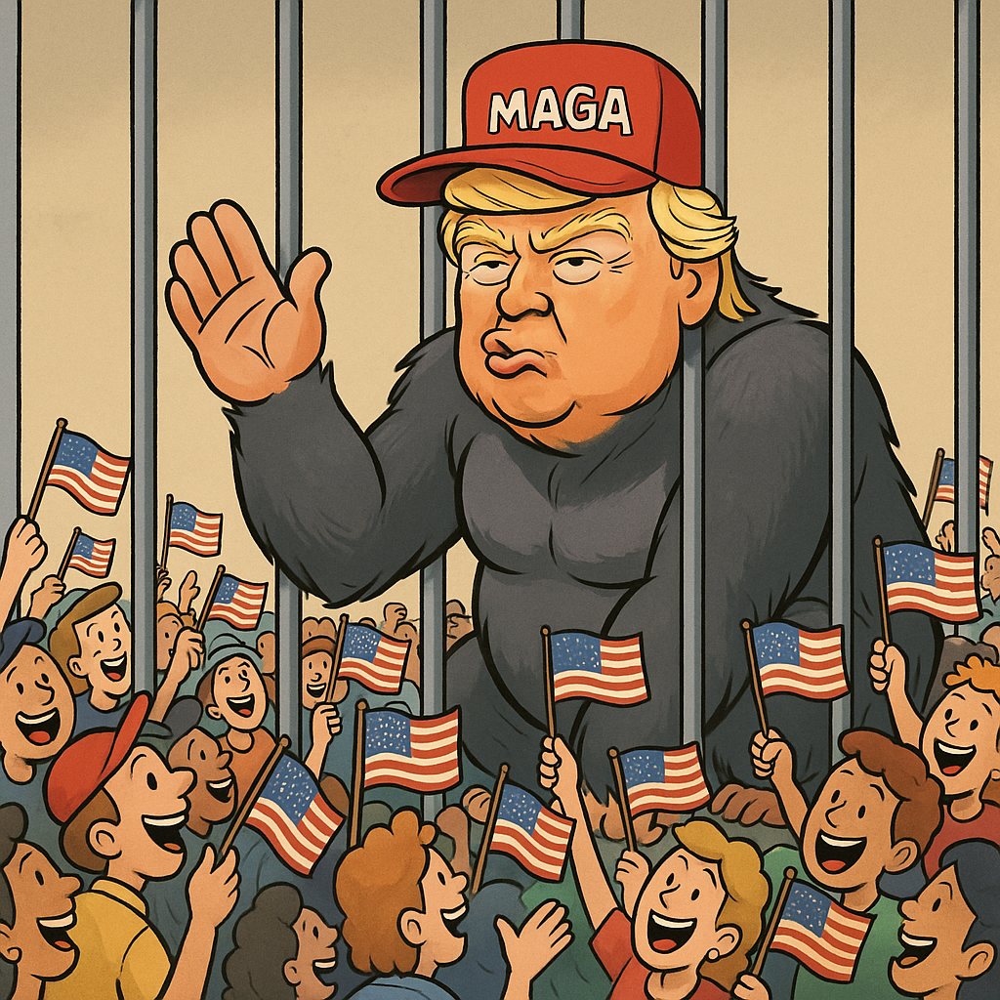

Voilà des années que Le Gorille fait partie de mon set guitare/chant, et mieux vaut tard que jamais, je viens d'en comprendre le sens profond. Avec l'habileté et l'ironie qu'on lui connaît, Brassens établit un lien entre la force brute (la virilité), le manque de sagesse, la loi du plus fort, l'éviction d'une justice véritable. Au vu de l'actualité du moment, il se pourrait bien que nous soyons amenés à prendre toute la mesure de son avertissement : Gare au goriii-iii-iii-iiille !

*Le Gorille © ChatGPT 2025*
